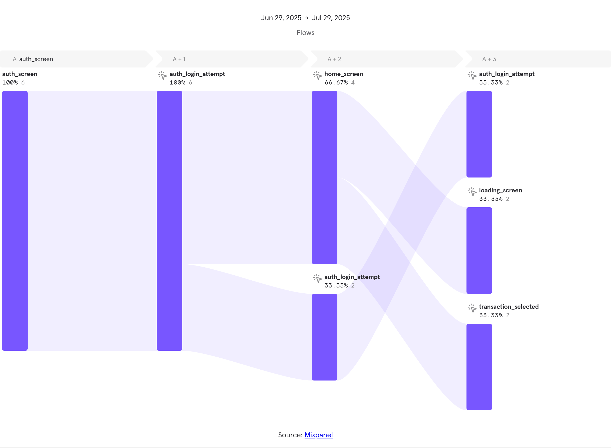

# 🚀 Bem-vindo ao **Walletly**

**Walletly** é um aplicativo mobile para visualização de saldo, histórico de transações e autenticação segura via PIN e biometria.

---

## 🔧 Como iniciar o projeto

### 1. Configuração do IP

Altere o IP local no arquivo `src/lib/axios.ts` para o IP da sua máquina onde o servidor mock vai rodar.

### 2. Mock Server

No seu terminal, execute:

```bash
yarn start:mock
```

O mock server estará disponível em http://localhost:3000.

### 3. Instalação e Execução

Em outro terminal, instale as dependências com o comando:

```bash
yarn
```

Para rodar a aplicação:

```bash
# iOS

cd ios && pod install

yarn ios

# Android
yarn android
```

---

## 📱 Sobre o Projeto

- 🔐 **PIN Seguro:** Criação e armazenamento de PIN usando Keychain com biometria integrada.
- 👤 **Autenticação Biométrica:** Login via Face ID ou Touch ID.
- 🧭 **Navegação Segura:** Separação entre rotas públicas e privadas.
- 🌐 **Internacionalização:** Ponte ajustada para busca de idioma do dispositivo, via módulo nativo.
- 💾 **Estado Global com Redux Toolkit mais persistência com MMKV:** Armazenamento local rápido e confiável com redux toolkit mais persist.
- 📊 **Tracking com Mixpanel:** : Trackeamento de evento de visualização e de cliques.
- 📦 **Componentes Reutilizáveis:** Componentes genéricos para consistência visual e de comportamento.
- 🧪 **Testes Unitários:** Escritas de alguns testes de unidade com Jest.

---

## 📂 Estrutura de Pastas

```
/src
  ├── components/              # Componentes reutilizáveis
  ├── hooks/                   # Custom Hooks (useAuth, trackerScreen etc.)
  ├── lib/                     # Bibliotecas nativas e integrações externas
  │   ├── axios/               # Configuração base do axios
  │   ├── mixpanel/            # Wrapper das funções do Mixpanel
  │   ├── deviceInfo/          # Wrapper das funções do device info
  │   ├── locale/              # Locale nativo do sistema
  │   └── keychain/            # Wrapper das funções de autenticação biométrica e PIN
  ├── navigation/              # Gerenciamento de navegação pública e privada
  │   ├── private.navigator.tsx
  │   └── public.navigator.tsx
      └── splash.navigator.tsx
  |
  ├── redux/                   # Redux Toolkit + persistência com MMKV
  │   ├── modules/             # Slices de estado (auth, balance, user etc.)
  │   ├── store.ts             # Store principal
  │   └── storage.ts           # configuração do redux-persist com MMKV
  ├── services/                # Requisições HTTP (axios)
  │   ├── auth.service.ts      # Serviço de comunicação com os endpoints de Autenticação
  │   └── home.service.ts      # Serviço de comunicação com os endpoints da Home do App
  ├── themes/                  # Paleta de cores e tema da aplicação
  ├── types/                   # Tipagens globais TypeScript
  ├── view/                    # Telas da aplicação
  │   ├── Home/
  │   ├── Onboarding/
  │   ├── TransactionDetails/
  │   └── Auth/
  ├── App.tsx                  # Entry point principal

```

---

## 🛠 Tecnologias utilizadas

- React Native
- TypeScript
- Redux Toolkit
- MMKV
- Mixpanel
- react-native-keychain
- i18n (internacionalização)
- Axios
- Jest + Testing Library
- json-server (mock de API)
- React Hook Form (com Yup)

---

## 📌 Observações

Pontos de melhoria: aprimorar a componentização para que os componentes tenham responsabilidades bem definidas, expandir e melhorar os testes, e aprimorar a visualização do tipo de linguagem do dispositivo.

---

## Eventos coletados pelo Mixpanel


